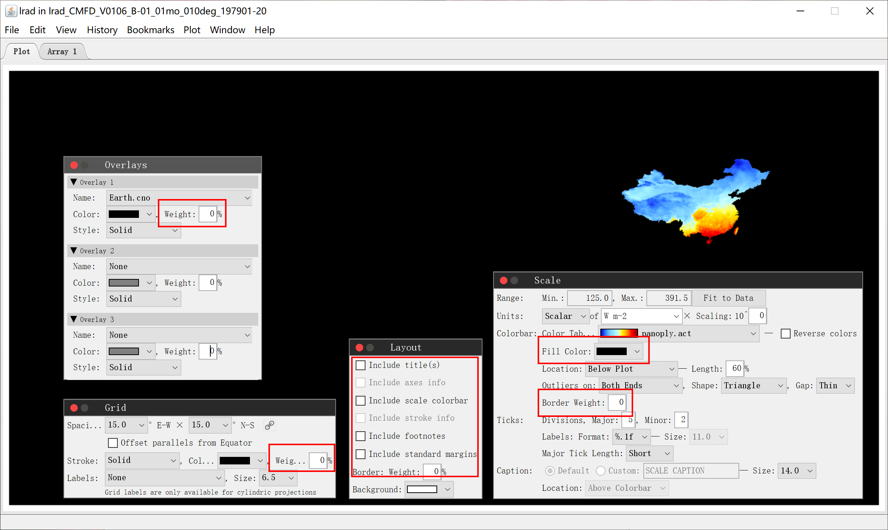
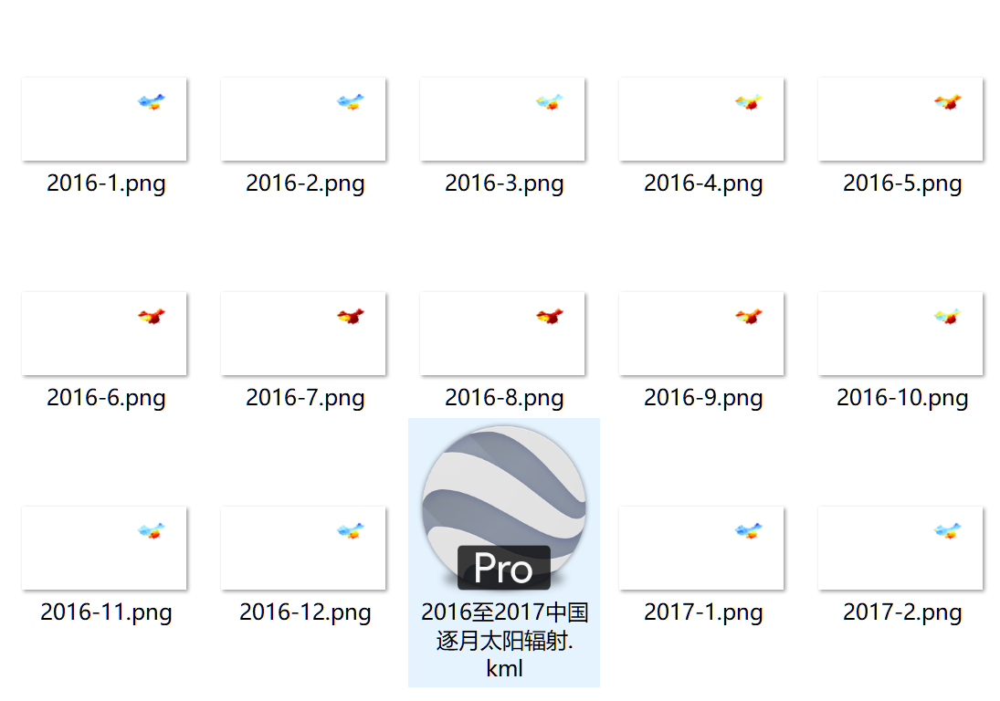
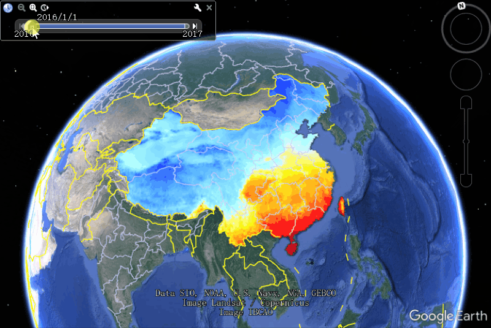

<p align="center">
 
 <h2 align="center">nc2kml</h2>
 <p align="center">将 netCDF 数据转换为适用于 Google Earth 和 Map 的 KML/KMZ 文件</p>
</p>
<p align="center">
  <a href="https://www.giss.nasa.gov/tools/panoply/download/">
      
  </a>
  <a href="https://github.com/pudding0503/nc2kml/releases">
  	
  </a>
  <a href="https://github.com/pudding0503/nc2kml/issues">
  	
  </a>
  <a href="https://github.com/pudding0503/nc2kml/blob/main/LICENSE">
  	
  </a>
</p>


### 1.安装 Panoply

由于我没有写 netCDF 生成并导出 Plot 的代码，所以需要借助 NASA 的 [Panoply](https://www.giss.nasa.gov/tools/panoply/download/) 软件进行导出。

[Panoply](https://www.giss.nasa.gov/tools/panoply/download/) 需要 Java 11 的环境，如果你不想安装整套的 JDK，可以使用 `.zip` 版并按照如下进行环境配置：

1. 去 Oracle 下载 JDK 包，下载 zip 格式的包：https://www.oracle.com/java/technologies/downloads/#jdk18-windows
2. 解压缩后放到合适的目录
3. 配置环境变量

```
CLASSPATH=,;%JAVA_HOME%\lib;%JAVA_HOME%\lib\tools.jar
JAVA_HOME=D:\dev\jdk-11.0.15

PATH=;%JAVA_HOME%\bin;%JAVA_HOME%\jre\bin;

（注：注意：变量值之间用";"隔开。注意原来Path的变量值末尾有没有;号，如果没有，先输入;号再输入。）
```

4. 输入 `java -version` 检查 Java 版本

### 2.例示数据

本例采用的 nc 数据为：

```
# 1979年1月至2018年12月的中国逐月太阳辐射数据集
lrad_CMFD_V0106_B-01_01mo_010deg_197901-201812.nc
```

本例采用的 nc4 数据为：

```
# 1980年1月1日的全球太阳辐射数据集
MERRA2_100.tavg1_2d_rad_Nx.19800101.nc4
```

这两个文件均可在 [Release](https://github.com/pudding0503/nc2kml/releases) 页面下载。

### 3.导出 Plot

使用 [Panoply](https://www.giss.nasa.gov/tools/panoply/download/) 打开 nc 文件，然后生成相应的 Plot 界面。在导出前需要对 Plot 进行一些设置，去掉一些元素。

#### 3.1 Plot 设置与导出

在 Plot 页面打开 **Overlays**, **Grid**, **Layout**, **Scale** 这四个窗口，将**所有的线条宽度改为 0**，**颜色底色设置为白色**，仅保留辐射渲染颜色部分即可。**界面边框改为 0**，**取消所有的标题和文字性的内容**。



然后选择 **File -> Export Animation**，按需导出需要的 png 图片序列：


#### 3.2 图片按序号排序

在你保存图片序列的文件夹根目录下，运行 `当前目录下按序号重命名.bat` 的批处理文件，即可将所有的 png 图片从序号 1 开始，逐个重命名。

#### 3.3 图片移除底色

由于 Panoply 导出的 png 图片无法设置为透明背景，所以还需要将白色底色进行移除。

你需要安装 Pillow 库：

```shell
pip install Pillow 
```

在 `去除白底.py` 中，设置路径为你的图片序列所在的文件夹即可（注意 Windows 下建议采用双斜杠或者单反斜杠）：

```python
# 设定 png 图片目录
path = "D://yourpath//480//"
```

然后运行此 Python 脚本即可，所有图片将全部删去白色底色。

### 4.生成 KML

KML 文件就是 Google Earth 导入需要的格式文件，而 KMZ 就是将 KML 和图片打包在一起的 ZIP 文件。KMZ 文件可以用 WinRAR 等进行解压。

打开 `生成KML文件.py` 文件，并且设置一些信息，例如数据标题，开始的年月、结束的年月日期等：

```python
# 信息
name = "1979年1月至2018年12月的中国逐日太阳辐射"
begin_year = 1979
begin_month = 1
end_year = 2018
end_month = 12
```

然后运行此 Python 脚本即可，运行成功后会在当前目录下生成 KML 文件。**最后请将这个 KML 文件放到你的图片序列的文件夹根目录下。**



如果你想要打包 KMZ 文件，请将上面截图中的全部文件进行 ZIP 打包，然后把后缀名更改为 KMZ 即可。

### 5.KML 的时间轴

当你编辑 KML 文件中的时间数据时，要注意参照官方文档 [Keyhole时间和动画](https://developers.google.com/kml/documentation/time?hl=zh_cn#timespans--) 中的说明。

```
# 例如逐月的时间
# 注意 1~9 必须要使用 01~09，否则将不能识别时间。
2018-01
2018-02

# 例如逐日的时间
2018-01-01
2018-12-28

# 例如 UTC 时间
1980-01-01T00:30:00+08:00
```

### 6.导入 Google Earth

将打包好的 KMZ 文件导入到 Google Earth Web 版，而 Google Earth Pro 同时支持 KML 和 KMZ 文件。

```
├── 2016至2017中国逐月太阳辐射
├── MERRA2 地表吸收的长波辐射 KML
```

两个由例示数据导出的 KML 文件，也在 [Release](https://github.com/pudding0503/nc2kml/releases) 页面提供下载。


